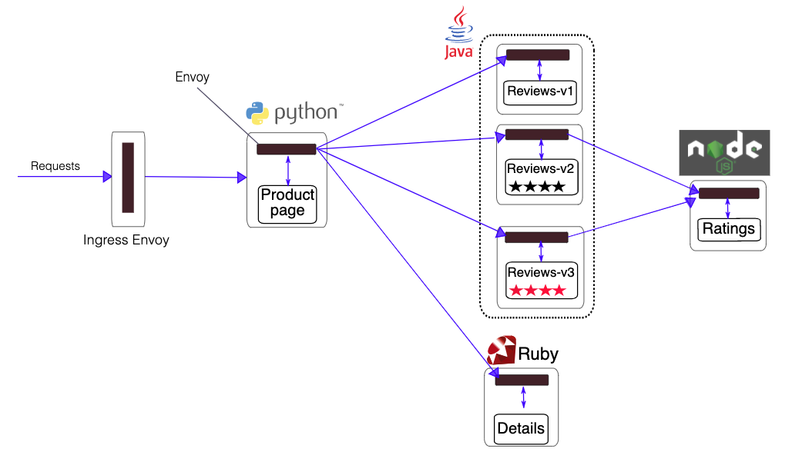

# istio 流量策略使用说明

### 前提条件

前提条件我们已经存在 `k8s` 和 `istio`。

### 测试用例

测试用例 我们就使用istio 官方使用的测试服务`BookInfo` 

Bookinfo应用程序分为四个单独的微服务：

productpage。该productpage微服务调用details和reviews微服务来填充页面。
details。该details微服务包含图书信息。
reviews。该reviews微服务包含了书评。它还称为ratings微服务。
ratings。该ratings微服务包含预定伴随书评排名信息。
reviews微服务有3个版本：

版本v1不会调用该ratings服务。
版本v2调用该ratings服务，并将每个等级显示为1到5个黑星。
版本v3调用该ratings服务，并将每个等级显示为1到5个红色星号。

访问关系如下图


首先部署bookinfo服务之前我们需要给 bookinfo 注入
sidecar,若给namespace打 `istio-injection=enabled`的labels 则istio会给当前namespace下的所有pod自动注入sidecar

假设我们将bookinfo 部署到demo的这个namespace中

```bash

$ kubectl label namespace demo istio-injection=enabled
```

查看labels是否设置成功

```bash
$ kubectl get namespace demo --show-labels
```

```text

```

部署bookinfo

```bash
$ kubectl apply -f bookinfo.yml
```

查看 服务是否正常部署且 成功注入sidecar

```bash
$ kubectl get po -n demo
```

确认 所有的service 和pod 都Running 

```bash
$ kubectl get service -n demo 

NAME          TYPE        CLUSTER-IP   EXTERNAL-IP   PORT(S)    AGE
details       ClusterIP   10.0.0.31    <none>        9080/TCP   6m
kubernetes    ClusterIP   10.0.0.1     <none>        443/TCP    7d
productpage   ClusterIP   10.0.0.120   <none>        9080/TCP   6m
ratings       ClusterIP   10.0.0.15    <none>        9080/TCP   6m
reviews       ClusterIP   10.0.0.170   <none>        9080/TCP   6m


$ kubectl get pods
NAME                             READY     STATUS    RESTARTS   AGE
details-v1-1520924117-48z17      2/2       Running   0          6m
productpage-v1-560495357-jk1lz   2/2       Running   0          6m
ratings-v1-734492171-rnr5l       2/2       Running   0          6m
reviews-v1-874083890-f0qf0       2/2       Running   0          6m
reviews-v2-1343845940-b34q5      2/2       Running   0          6m
reviews-v3-1813607990-8ch52      2/2       Running   0          6m
``` 

如果所有pod ready 显示 2/2 则 服务正确注入sidecar

### 流量管理

####

#### 交通管理

#### 安全

#### 可观察性


### 参考文档