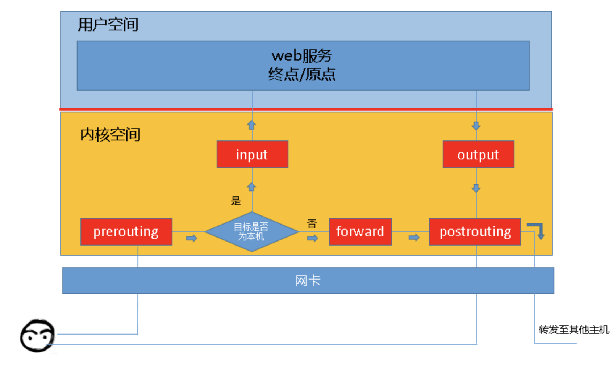

# iptables 详解

iptables其实不是真正的防火墙，我们可以把它理解成一个客户端代理，用户通过iptables这个代理，将用户的安全设定执行到对应的"安全框架"中，这个"安全框架"才是真正的防火墙，这个框架的名字叫netfilter

netfilter才是防火墙真正的安全框架（framework），netfilter位于内核空间。

iptables其实是一个命令行工具，位于用户空间，我们用这个工具操作真正的框架。

iptables 的表（tables） 和链（chains）
描述完iptables术语后、相信大家对iptables的表和链有了初步的了解了、默认情况下。Iptables，根据功能和表的定义划分、最常用的有三个表，分别是filter,nat mangle.其中每个表又有各自包含不同的操作链（chains）



#### 处理动作
处理动作在iptables中被称为target（这样说并不准确，我们暂且这样称呼），动作也可以分为基本动作和扩展动作。

此处列出一些常用的动作，之后的文章会对它们进行详细的示例与总结：

* `ACCEPT`：允许数据包通过。

* `DROP`：直接丢弃数据包，不给任何回应信息，这时候客户端会感觉自己的请求泥牛入海了，过了超时时间才会有反应。

* `REJECT`：拒绝数据包通过，必要时会给数据发送端一个响应的信息，客户端刚请求就会收到拒绝的信息。

* `SNAT`：源地址转换，解决内网用户用同一个公网地址上网的问题。

* `MASQUERADE`：是SNAT的一种特殊形式，适用于动态的、临时会变的ip上。

* `DNAT`：目标地址转换。

* `REDIRECT`：在本机做端口映射。

* `LOG`：在/var/log/messages文件中记录日志信息，然后将数据包传递给下一条规则，也就是说除了记录以外不对数据包做任何其他操作，仍然让下一条规则去匹配。

### iptables具有以下4个内置表


#### 1. Filter

```bash
Filter表

和主机自身相关、负责防火墙（过滤本机流入、流出数据包）。

是iptables默认使用的表、这个表定义了三个链（chains）说明如下

INPUT  负责过滤所有目标地址是主机（防火墙）地址的数据包、通俗的讲、就是过滤进入主机的数据包。

FORWARD  负责转发流经主机但不进入本机的数据包、起转发作用、和NAT表关系很大、后面会详细介绍

OUTPUT  处理所有原地址是本机地址的数据包、通俗的讲就是处理从主机发出去的数据包。
```

#### 2. NAT表

```bash
NAT表

是网络地址转换的意思。即负责来源与目的IP地址和port的转换、和主机本身无关。一般用于局域网多人共享上网或者内网IP映射外网IP及不同端口转换服务等功能。Nat表的功能很重要、这个表定义了三个链（chains）

OUTPUT

主机发出去的数据包有关、在数据包路由之前改变主机产生的数据包的目的地址等。

PREROUTING

在数据包刚到达防火墙时、进行路由判断之前执行的规则、改变包的目的地址（DNAT功能）、端口等（通俗比喻，就是收信时、根据规则重写收件人的地址、这看上去不地道啊、）把公司IP映射到局域网的机器上、此链多用于把外部IP地址端口的服务、映射为内部IP地址及端口

POSTROUTING

在数据包离开防火墙时进行路由判断之后执行的规则、改变包的源地址（SNAT）、端口等（通俗比喻、就是寄信时写好发件人的地址、要让人家回信是能够有地址可回）刺链多用于局域网共享上网，把所有局域网的地址、转换为公网地址上
```

#### 3. Mangle

```bash
Mangle

主要负责修改数据包中特殊的路由标记，如TTL、TOS、MARK等、这个表定义了5个链（chains）

INPUT

同filter表的INPUT

FORWARD

同filter表的FORWARD

OUTPUT  同fileter表的OUTPUT

PREROUTING  同nat表的PREROUTING

POSTOUTING  同nat表的POSTOUTING

```

#### 4. Raw

```bash


```

后面在说

### 参数定义

```bash
-t：指定要操纵的表； `table`

-A：向规则链中添加条目；`Append`

-D：从规则链中删除条目； `delete`

-I：向规则链中插入条目；`insert`

-R：替换规则链中的条目；`replace`

-L：显示规则链中已有的条目；``

-F：清除规则链中已有的条目；`flush`

-Z：清空规则链中的数据包计算器和字节计数器；

-N：创建新的用户自定义规则链；

-P：定义规则链中的默认目标；`policy`

-h：显示帮助信息；`help`

-p：指定要匹配的数据包协议类型；`proto	protocol: by number or name, eg. tcp`

-s：指定要匹配的数据包源ip地址；`source`

-d：指定要匹配的数据包目标ip地址；`destination`

-j：指定要跳转的目标；`jump`

-i：指定数据包进入本机的网络接口（网卡）；`input`

-o：指定数据包离开本机的网络接口（网卡）；`onput`

--sport：匹配来源端口号；`source port`

--dport：匹配目标端口号。`destination port`

下述规则允许端口80上的传入HTTP通信。
```

#### 例如

```bash

$ iptables -A INPUT -i eth1 -p tcp --dport 80 -d 1.2.3.4 -j ACCEPT

```

-A 表示我们正在添加新规则。缺省情况下，除非您指定另一个表，否则iptables会将所有新规则添加到 Filter 表中。

-i 标志指定将规则应用到的设备。如果您未指定设备，则iptables会将规则应用于所有传入流量，而与设备无关。

-p 标志指定要处理的数据包协议，在本例中为TCP。

–dport 标志指定目标端口，该端口为80。

-d 指定目标IP地址，即1.2.3.4。如果未指定目标IP地址，则该规则将适用于eth1上的所有传入流量，而不管IP地址如何。

-j 指定要执行的操作或JUMP操作。在这里，我们使用接受策略来接受数据包。

开放端口指定插入第几行

```bash
# --line-number 展示行号
$ iptables -nL  --line-number

# 在第四行插入iptables
$ iptables -I INPUT 4 -p tcp --dport 1234 -j ACCEPT

```

禁止所有INPUT

```bash
$ iptables -P INPUT DROP
$ iptables -P OUTPUT DROP
```


我现在用一个测试软件来测试连通性

### 四、nc搭建简单内网聊天室

本机-本机 ， 单台机器开了两个shell窗口，当一个窗口输入消息时，另一个窗口也会同步显示

```bash
ncat -v -lp 8080
```

#### 服务端

```bash
[root@localhost ~]$ ncat -v -lp 8080
Ncat: Version 7.50 ( https://nmap.org/ncat )
Ncat: Listening on :::8080
Ncat: Listening on 0.0.0.0:8080
Ncat: Connection from 127.0.0.1.
Ncat: Connection from 127.0.0.1:45996.
xxx
xxx
```

##### 客户端

```bash
[root@localhost ~]$ nc -v 127.0.0.1 8080
Ncat: Version 7.50 ( https://nmap.org/ncat )
Ncat: Connected to 127.0.0.1:8080.
xxx
xxx
```

### NAT 作用及使用

我们现在讲一下nat表主要的作用

端口转发

```bash

# 将 8080 转发到80 端口上面

 $  iptables -t nat -A PREROUTING -p tcp --dport 8080 -j REDERECT --to-ports 8000

# 如果防火墙默认是关闭的状态

则需要设置以下规则

$ iptables -A INPUT -p tcp --dport 8000 -j ACCEPT

$ iptables -A OUTPUT -p tcp --sport 8000 -j ACCEPT


```

#### 流量转发

##### 将流量转发到服务器上面

在 10.10.13.111 上 设置 将 对 10.10.13.111的请求转发到10.10.13.110 并实现 逆转,

```bash
iptables -t nat -I PREROUTING -p tcp --dport 8001 -d 10.10.13.111 -j DNAT --to-destination 10.10.13.110

iptables -t nat -I POSTROUTING -p tcp --dport 8001 -d 10.10.13.110 -j SNAT --to-destination 10.10.13.111
```
